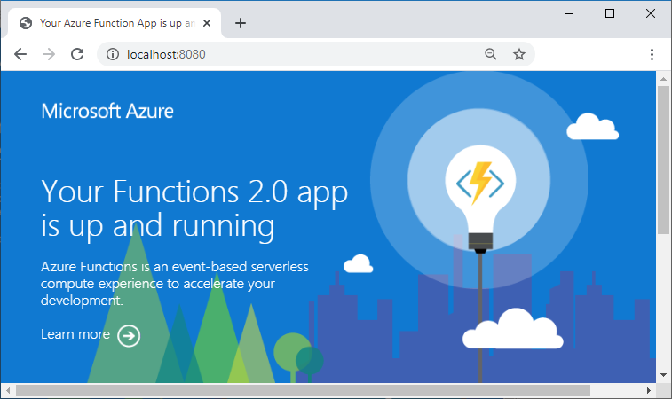

As businesses of all size continue to migrate to the cloud, securing these resources is a growing concern. Even with a zero-trust model, misconfigurations and other human-driven errors can continue to expose assets and leave organizations open to attack. 

Finding where these gaps are is my job as a threat hunter, and I’ve developed this set of resources to help anyone detect common errors in Microsoft’s Azure cloud. This set of Azure Powershell scripts utilize the Azure Resource manager service to automatically find misconfigurations and alert analysts. 

This blog post will discuss these scripts, their goals, and expected results.

<!--more-->


<head> 
    <style> 
    sup { 
        vertical-align: super; 
        font-size: medium; 
    } 
    </style> 
</head> 

- TOC
{:toc}

# Hunting with Azure Resource Manager
{: .toc}

Azure Resource Manager (RM) "is the deployment and management service for Azure. It provides a management layer that enables you to create, update, and delete resources in your Azure account. You use management features, like access control, locks, and tags, to secure and organize your resources after deployment."<sup>[1]</sup> However, it also allows you to simply query resources for configurations - from here we can automate over large scopes and use logic to test security controls.


<p align="center">
  
</p>
<p align="center">(<i> Azure Resource Manager </i><sup>[2]</sup>)</p>


## The Tool Suite
{: .toc}

If you have worked in Azure for any time deploying resources, you can quickly see that there are many different types of resources and each type has its own set of features a hunter could be interested in. Hence the reason why this blog and these tools are living documents, being added to and updated frequently (*hopefully*). Regardless, these are the resources and the findings that are currently detected.

All of these tools can be found on [GitHub <sup>[3]</sup>](https://github.com/jaredscottwilson/AzureRMScripts "jaredscottwilson/AzureRMScripts")

### Azure Storage Account Blobs
{: .toc}

According to Microsoft "Azure Blob storage is Microsoft's object storage solution for the cloud. Blob storage is optimized for storing massive amounts of unstructured data. Unstructured data is data that doesn't adhere to a particular data model or definition, such as text or binary data."<sup>[4]</sup> It is important to understand that there are differences in Storage Accounts, Containers, and Blobs. The below image shows how these are nested. Storage Accounts can contain Containers, which can contain Blobs. In a more simplified manner, it can be conceptualized as storage device, directories, and files. Storage Accounts and Containers are akin to AWS S3 Buckets.

<p align="center">
  
</p>
<p align="center">(Containers vs Blobs <sup>[4]</sup>)</p>

There are three degrees of permissions within Containers, and this is where Find-Containers comes into play. <sup>[5]</sup>

- **No public read access**: The container and its blobs can be accessed only by the storage account owner. This is the default for all new containers.
- **Public read access for blobs only**: Blobs within the container can be read by anonymous request, but container data is not available. Anonymous clients cannot enumerate the blobs within the container.
- **Public read access for container and its blobs**: All container and blob data can be read by anonymous request. Clients can enumerate blobs within the container by anonymous request, but cannot enumerate containers within the storage account.

Access level can be changed in many manners, but the following shows the different levels of permissions in the Azure Portal user interface.

<p align="center">
  
</p>
<p align="center">(Storage Permissions <sup>[5]</sup>)</p>

The Find-Containers tool allows the user to loop through all of their subscriptions to identify any Container/Blob that does **not** have public access disabled. It is then the analyst's job to review the results for risk and risk acceptance.

[Find-Containers.ps1](https://github.com/jaredscottwilson/AzureRMScripts/blob/master/Find-Containers.ps1)


### Azure Analysis Services
{: .toc}

Azure Analysis Services is a fully managed platform as a service (PaaS) that provides enterprise-grade data models in the cloud. Analysis Services ... provides an easier and faster way for users to perform ad hoc data analysis using tools like Power BI and Excel.<sup>[6]</sup>

The Find-OpenAnalysisServices tool will loop through all available subscriptions and identify any Analysis Services that either **don't have a firewall enabled on the resource** or **have firewall entries that don't align with the "known good" list of IPs in the script**.

Microsoft encourages users to enable the Analysis Service firewall only allowing client IPs that require access.<sup>[7]</sup>


[Find-OpenAnalysisServices.ps1](https://github.com/jaredscottwilson/AzureRMScripts/blob/master/Find-OpenAnalysisServices.ps1)


### Azure WebApps
{: .toc}

Azure App Service is an HTTP-based service for hosting web applications, REST APIs, and mobile back ends.<sup>[8]</sup>

These applications have a lot of potential to leak sensitive details to the internet, so the Find-OpenApps tool specifically is used to access the WebApp to determine if it is returning 200 OK results and if it is a custom application. If it one of the default application pages (see below <sup>[9]</sup>), it is not considered an issue the tool will continue to loop through Subscriptions and WebApps.

<p align="center">
  
</p>
<p align="center">(Running Default Application Example <sup>[9]</sup>)</p>

A WebApp that does not have default details and is internet accessible could potentially host sensitive details.

[Find-OpenApps.ps1](https://github.com/jaredscottwilson/AzureRMScripts/blob/master/Find-OpenApps.ps1)


### Azure CosmosDBs
{: .toc}

Azure Cosmos DB is Microsoft’s globally distributed, multi-model database service for operational and analytics workloads.<sup>[10]</sup>

To secure data stored in your account, Azure Cosmos DB supports a secret based authorization model that utilizes a strong Hash-based Message Authentication Code (HMAC). Additionally, Azure Cosmos DB supports IP-based access controls for inbound firewall support.<sup>[11]</sup>

<p align="center">
  
</p>
<p align="center">(CosmosDB Firewall <sup>[12]</sup>)</p>

As a similar theme to this tool suite, the Find-OpenCosmosDB analyzes all CosmosDB firewalls to see if the firewall exists and if it does, if there are abnormal rules that do not align with the list of known good source IP ranges and when identified, provided to the analyst.

[Find-OpenCosmosDB.ps1](https://github.com/jaredscottwilson/AzureRMScripts/blob/master/Find-OpenCosmosDB.ps1)


### Azure Key Vaults
{: .toc}

Azure Key Vault is a tool for securely storing and accessing secrets. A secret is anything that you want to tightly control access to, such as API keys, passwords, or certificates. A vault is a logical group of secrets.<sup>[13]</sup>

The virtual network service endpoints for Azure Key Vault allow you to restrict access to a specified virtual network. The endpoints also allow you to restrict access to a list of IPv4 address ranges. Any user connecting to your key vault from outside those sources is denied access.<sup[14]</sup>

It is important to state that simply because a firewall is not enabled does not mean the key vault is completely vulnerable to attack, there are other layers of security and authentication required. However, it does mean that there is a layer of security that is missing and should be enabled to ensure defense in depth.

The Find-OpenKeyVault tool will iterate through all subscriptions and all Key Vaults to identify Key Vaults with no firewall or abnormal rules.

[Find-OpenKeyVault.ps1](https://github.com/jaredscottwilson/AzureRMScripts/blob/master/Find-OpenKeyVault.ps1)


### Azure Redis
{: .toc}

Azure Cache for Redis provides an in-memory data store based on the open-source software Redis.<sup>[15]</sup> 

Azure Redis resources have the configuration option of allowing "non-SSL port" to be enabled. Redis server does not natively support TLS, but Azure Cache for Redis does. If you are connecting to Azure Cache for Redis and your client supports TLS, like StackExchange.Redis, then you should use TLS.<sup>[16]</sup> This non-SSL port configuration is a key configuration the Find-OpenRedis tool looks for, along with misconfigured firewalls and firewall rules.

[Find-OpenRedis.ps1](https://github.com/jaredscottwilson/AzureRMScripts/blob/master/Find-OpenRedis.ps1)

### Azure SQL Servers
{: .toc}

Azure has its own SQL Server resources that then align with a SQL Database resources. These SQL Server resources, as one would expect, deploy the same resource-level firewalls as other Azure resources. The Find-OpenSQLServerRules tool deploys the same logic to detect these servers with no firewall or misconfigured firewalls.

Additionally, SQL Servers have firewall permissions that are essentially a Deny All by default (see image below). The Find-OpenSQLServerRules tool will also identify resources that are Allow by default.

<p align="center">
  
</p>
<p align="center">(SQL Server Firewall Configurations <sup>[17]</sup>)</p>

[Find-OpenSQLServerRules.ps1](https://github.com/jaredscottwilson/AzureRMScripts/blob/master/Find-OpenSQLServerRules.ps1)

## Explore For Yourself!

One neat workflow that is common between all of these tools is the ability to loop through subscriptions and explore what resources are available in your environment to then dig deeper on. I encourage you to run through the following command to get a sense of what type of resources are in your environment and how you can explore the ever-growing cloud that is Azure.

```powershell
#IMPORTANT - If you don't have a connected Azure account to PS, you use this to connect/auth
#Connect-AzureRmAccount
#Get all of the unique subscription IDs in your environment
$subscriptions = ((Get-AzureRmSubscription).Id | sort | Get-Unique)

#loop through the subscriptions
foreach($line in $subscriptions) {
	#Set your subscription to the subscription $line, as we loop through.
	Select-AzureRmSubscription -SubscriptionName $line	
	#Collect the unique resources type for the current subscription
	$resources = ((Get-AzureRmResource).ResourceType | sort -u)
	#output the resources types
	$resources
}
```

This will output all of the resource-types (i.e. 'Microsoft.Storage/storageAccounts', 'Microsoft.Compute/virtualMachines', etc) for you to then visually parse and investigate.

**Happy Hunting!!**


## References
{: .toc}
1. https://docs.microsoft.com/en-us/azure/azure-resource-manager/management/overview
2. https://docs.microsoft.com/en-us/azure/azure-resource-manager/management/media/overview/consistent-management-layer.png
3. https://github.com/jaredscottwilson/AzureRMScripts
4. https://docs.microsoft.com/en-us/azure/storage/blobs/storage-blobs-introduction
5. https://docs.microsoft.com/en-us/azure/storage/blobs/storage-manage-access-to-resources
6. https://docs.microsoft.com/en-us/azure/analysis-services/analysis-services-overview
7. https://azure.microsoft.com/en-us/blog/hardening-azure-analysis-services-with-the-new-firewall-capability/
8. https://docs.microsoft.com/en-us/azure/app-service/overview
9. https://docs.microsoft.com/en-us/azure/azure-functions/functions-create-function-linux-custom-image
10. https://docs.microsoft.com/en-us/azure/cosmos-db/
11. https://docs.microsoft.com/en-us/azure/cosmos-db/firewall-support
12. https://docs.microsoft.com/en-us/azure/cosmos-db/how-to-configure-firewall
13. https://docs.microsoft.com/en-us/azure/key-vault/general/basic-concepts
14. https://docs.microsoft.com/en-us/azure/key-vault/general/overview-vnet-service-endpoints
15. https://docs.microsoft.com/en-us/azure/azure-cache-for-redis/cache-overview
16. https://docs.microsoft.com/en-us/azure/azure-cache-for-redis/cache-faq
17. https://docs.microsoft.com/en-us/azure/sql-database/sql-database-connectivity-settings
