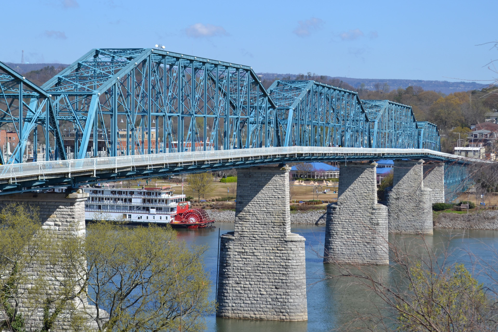
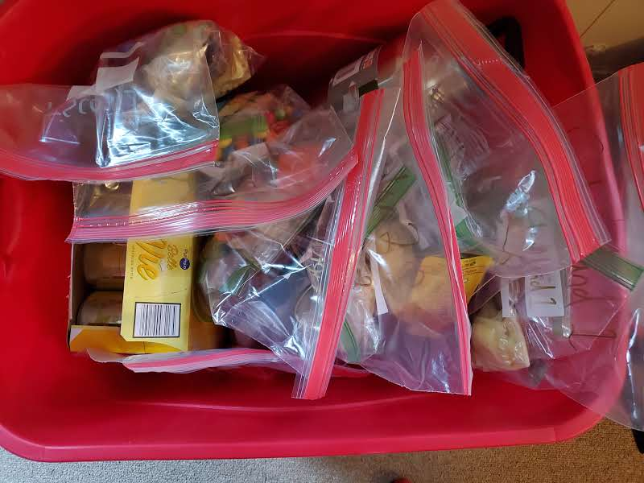

#### 28 hours 20 minutes and 53 seconds.

<!--more-->

  

It all started out with [this](https://youtu.be/8YWyac1ZdsU "The Why")

_Why One Hundred Miles..._

One late summer evening in 2019 on my phone watching Billy Yang's video "The Why". 

Listening to a muffled Ken Chlouber and the future Leadville 100 runners yelling I COMMIT, I WON'T QUIT. 

Listening to Billy narrate "_I often wonder, is there something in our DNA that strangely finds comfort in this discomfort._".

Something deep within me clicked. I find it difficult to articulate what exactly changed - going to those lows to challenge myself, exploring the limits of my mind and body, committing and attempting to accomplish the hardest physical test of my life to show my kids anything is possible? Likely a mix of them all. Regardless, that's where the seed took root.

> "I commit, I won't quit" 
> #Chattanooga100 #sevendays #notallpainissignificant #sometimesyoujustdothings

The start of the race was in trendy North Shore Chattanooga, at the north side of the Walnut St. Bridge (the beautiful walking bridge crossing the Tennessee River). It was a beautiful morning, partly cloudy with a high in the upper 50s and low in the mid to low 30s. The run across the bridge and the first five miles of the race were on the beautiful Chattanooga River Walk, a set of walking paths along the TN River. These first five flat miles (net negative elevation) were really nice as it allowed me to loosen and warm up and also bank some time for the future cut offs.

  
  
  

(<i>Walnut Street Bridge and Race Start</i>)

To this day I can't tell you why, I did not change anything at all on race day, but at about mile 3 to 4 I started to feel a slight itch on the toes of my right foot. I thought it was just an itch... I'll soon find out I was sorely mistaken.

Your start onto trails (mile ~5) is into the John C. Wilson Memorial Park. This was a super pleasant last minute change by RunBum, adding more trail and less road. Additionally, this is a super neat little park with easy access that I had no idea existed. After exiting the park you really head into Lookout Mountain, there is aid here at Ruby Falls. This was a nice aid station with great workers. I was feeling really good. They also allowed a drop bag with our trail shoes, so I could take my road shoes off, and swap for my Speedgoats (to pick up road shoes at the finish).

  

(<i>John C. Wilson Memorial Park</i>)

  

(<i>Bridge just past John C. Wilson Memorial Park in the evening</i>)

Tackle the next 5 miles (5-10) with the understanding that besides the Cloudland Canyon Steps (mile ~50) this will be the most elevation you gain in a 5 mile chunk (1,300 ft in 5 miles); still nothing "terrible", this is a very moderate elevation course, but for the course, it's tough.

At about mile 9.9 you'll hit Sunset Rock, make sure you stop somewhere along this route to snag a picture. It's just beautiful.

After finishing the Bluff Trail you'll head up into the aid station at Covenant College (mile ~14). For the stretch up to this point I've felt great. The weather was cool, I felt loose, muscles and HR also felt great. I did continue to notice a bit of an itch on my toes but, still, not the feeling of a "warm" rub like I'd expect if there were issues. Covenant College aid station was the first stop where I was able to see part of my crew.

> Let me pause here to say how AMAZING of a crew I had to tackle this and how much crap they put up with from me. I had numerous spreadsheets, text threads, "plans", two heavy plastic boxes of gear, multiple bags. To say my type-A kicked in would be an understatement. I even had a great friend from college and fellow ultra runner drive over from North Carolina to help. I've said it multiple times, but will say again, thank you Josh, Carter, James, Matt, Paul, and Noah - ya'll made this possible.

  

(<i>Gear</i>)

  

(<i>Aid Station Bag Prep</i>)

  

(<i>The Crew Bin</i>)

  

(<i>The Crew Minus Carter</i>)

  

(<i>Race Morning Crew Chat</i>)

Carter drove 325 miles one way to crew. Additionally he had a mostly "easy" pacing portion (last 10 miles), but last minute he got handed 10 miles in Cloudland Canyon, which is in my opinion the most challenging terrain section. it had ~1800 ft gain with over 600 stairs, literal stairs. It was savage. Oh and it went from 11:30pm to ~3am.

Matt, the crew-car lead for Friday evening, committed to crewing and was already planning to run the Chattanooga 50 miler Saturday morning!! So he crewed Friday evening into the night then got up at like 3am-ish to run the 50 miler, which he crushed. 

Josh didn't just pace a "portion" of the race. Josh ran 42.85 miles alongside me constantly encouraging me to keep moving forward. Relentless forward progress. He also put up with my grumbling the last ~7 miles when I couldn't run and was just pissed about the trail NEVER ENDING.

James ran the first pacing segment which he didn't realize but he was distracting me from a very serious upset stomach, keeping me from puking, and ran it with a pretty serious injury himself. He then went and slept in his car at an aid station and helped crew in the crew car the next morning.

Paul and Noah both supported in the crew car throughout a blistering cold night, literally over night, sleeping very little and then heading back in the morning to put in a whole day with their family.

So I hit Covenant. Here Carter (just arrived from his drive) and Matt were waiting with my box, my nutrition bag, and refilled tailwind bottles (decaffeinated at this point). It was great to see friendly faces and to pause for a minute. Based on my Strava it said I had 90 minutes of non-movement time. This averages 6 minutes non-moving for all aid stations. Given what we discover at Ascolon Rd. Crossing, I thought this was pretty good. I think the Strava numbers are a bit short. In any future endeavors I will FOR SURE try to move quicker in aid and try to sit down a LOT less. After refueling I hit the road heading towards Lula lake.

This stretch (mile 14-20) is a great slightly downhill section to regain some time, but also not push too hard (there will be plenty of time for that). Lula lake was beautiful and is a key feature of this course that I encourage you to stop and enjoy. There's a really neat spot, Adventure trail, where you literally need to use a rope to climb up, this is just past the Lula lake falls. After making that climb you have some really scenic picnic spots along a wide trail. Another beautiful spot for pictures, get all the selfies.

  

(<i>Beautiful Lula Lake Falls</i>)

  

  

  

(<i>The views off the edge</i>)

One abnormality, which I suspect isn't going to happen again, is that after this stretch and before Nickajack there was a bus (like the school buses) that all the racers hopped on, went a few miles down the road to the Nickajack aid station, and got off. This was due to a land access issues that RunBum ran into in the planning. A lot of folks got screwed with this when they had to wait for the bus, I lucked out in both directions that as soon as I arrived, the bus was ready to take off. I enjoyed the minute to warm up and fuel while not running.

  

(<i>A little foot maintenance on the bus</i>)

At around mile 25 was the Nickajack aid station, this was supposed to be a crew access point, but ended up last minute not allowing crew. This was a bummer. I really could have used some encouragement from the guys for the next chunk of miles. But regardless, refueled with some yummy hot food and kept moving.

  

(<i>Trail at Sunset</i>)

After leaving Nickajack is when it started to get real. Nickajack is at mile 25 and the next aid (Ascolon Rd. Crossing) is at mile 34.6, that's a good 9 miles that feels like 15. After about 2 miles into this stretch there was a guy maybe 200 yards ahead of me, I was gaining some ground on him, not trying to pass but just doing my own thing. Once I got within 20-30 meters he was running and I heard just a big "splash", he went ankle deep into a nasty puddle. Wet shoes aren't uncommon in ultras, but they weren't necessary in this race. To his credit, he didn't miss a beat and kept on moving. Additionally in this stretch it finally got dark dark, breaking out the headlamp. I'm not a novice to trail running in the dark, but normally I just run so early in the morning that it's dark, so running into the darkness knowing I won't see daylight for some time is daunting and creepy. To add to the creepiness of it, this was the first time in the race where I really didn't see or hear anyone around me, just the nature. There was a moment where I was running, there must have been a strong wind, and in the woods behind me there was a loud SNAP! It sounded like a BIG tree branch snapped. It FREAKED me out, my pace and HR picked up for a bit. At around mile 28 I gave my amazing wife, Jamie, a call, talked to her a bit and my kids to tell them how it's going, tell them I love them, say goodnight. It was suuuuch a blessing talking to them.

> Let me take another pause to say that Jamie was an another essential piece to the puzzle allowing me to tackle this beast of an adventure. Think about it this way, the race took me 28+ hours, so that's a day plus without spouse support in the day to day of taking care of three kids (newborn, 2, and 7), but that's really just the tip of the iceberg. Going into this race I put in at least 170+ hours of training with many long weekend mornings and afternoons not around. Like that isn't enough, I talked about the race SO much I'm sure she was sick of hearing about it. All that said, she helped me so much in all this, supported me, encouraged me, and just was the support system I needed to make it through this crazy terrible process of running 100 miles.

Ok, back into it. In The Why by Billy Yang, discussing why attempt a 100 miler Zach Miller states "it's a real test of the human will, the human spirit", and at this point is where I really started to his that ultra marathon "low". Mile 30 to 34 was just super low, my legs hurt just a bit, but my mind was going negative, lots of thoughts like "why is the aid so far apart", "am I almost there", "this is ridiculous, it has to be soon". Thankfully about 3/4 of a mile before Ascolon Rd. Crossing aid station I ran up on a group of five folks running together, one of them had this neon glow shirt on, it was pretty cool and helped keep my mind busy and positive. I was thankful for the conversation. They gave me a nickname but I'm forgetting what it was lol. I think Saint Thomas? I don't remember why or how, but I remember they gave me a nickname, inducing a lot of laughs. It's funny in ultra marathons you're in such a different cognitive state that portions which should be memorable aren't, and portions that shouldn't be are. It's wild.

> "When you learn how to suffer, you suffer much less."

Phew. Mile 34/35. Ascolon. Made it. Crew access, aid station, first pacer, and a MASSIVE blister. 

Arriving to Ascolon before I even came off the trail I heard  James, Matt, and Carter calling through the woods to see if it was me, I called back, they cheered, it was so refreshing and fun. I sat down, which was nice because I knew something was wrong. There was at least one time where I kicked a rock with my right foot. It hurt a LOT more than normal rock kicks... I really suspected something was wrong. We took my right shoe and sock off and I had the biggest blister that I've ever had on my second toe (next to big toe). I was shocked. We didn't really know what to do. I had liquid band-aid and duct tape but really the blister didn't hurt much when running, only when I kicked things or poked at it.... which ideally I shouldn't be doing. So we applied lube, new sock, got my fuel (pizza and ramen) and kept on. Here my first pacer, James, joined me.

  

(<i>Ascolon Aid Station</i>)

  

  

  

James paced from Ascolon (mile ~34) to Cloudland Canyon (mile ~43). This stretch of the course was actually supposed to have water at the GA 189 crossing but there was definitely no water to be had.... I was well stocked up though, enough to get me through the stretch. The trail in this portion was really runable and not very challenging. I mean, it was still a trail in the middle of the night, but not anything to be super concerned with. If you remember that pizza and ramen I had... Bad bad move. I was having a lot of stomach issues in this section, James just kept talking to me, kept me laughing and feeling good. It was so very appreciated.

Arriving at Cloudland Canyon at around 41 we did the normal "routine" now, sit down, quick food in my hands, refill water, shoe off, lube on toe, new sock, shoe on, more food, keep running. Here James dropped off, got some sleep, and then crewed in the morning. I also got to see Carter again and two new faces with Noah and Paul, it was great to see them all. Carter was picking up the pacing here from James... we both had no idea what we were getting ourselves into hahahaha. 

  

(<i>Paul and Carter Chilling with some Pizza</i>)

  

(<i>Paul and Noah's shoes pouring out a cold one for their homie</i>)

The Cloudland portion performed a little loop around the park before heading down into the trail which included a little stretch and then straight to the stairs, over 600 metal stairs we had to descend. Physically it wasn't too bad, it was difficult, but not debilitating, but having never been there it was mentally draining. It was pitch dark so you couldn't see the end of the staircases, and they just kept going and going and going. It was astounding. We did finally get to Sittons Gulch (the true turn around point). I had expected this to be limited to no aid (based on race documents) but there was canopy there with a bunch of super friendly folks making some DELICIOUS grilled cheese sandwiches along with a big fire burning. I'm actually pretty sure some of the grilled cheese was very burnt, but it was still close to the best grilled cheese I've ever had.

  

(<i>Savagery</i>)

We turned around faced down the stairs of doom. Going down wasn't too tough, going up, another story. Both of us struggled, seriously. We then reached the top and had about ~2 miles of very difficult rooty trail. There was a mile stretch that was SO rooty I power walked probably half of it. Roots are really tough to clear after you power hike 600+ stairs. Eventually though, Carter and I hit Cloudland Canyon Park Road (~57) and that lasted until about mile 60 when we hit Cloudland Canyon Aid Station 2. Carter and I had a good time walking, jogging, and talking on this stretch. Catching up. We had an awesome God-moment enjoying a shooting star in the beautiful night sky in Cloudland Canyon. At this point pace really didn't matter in my mind, I felt most in-the-moment in this stretch, exactly where you want to be.

> "Only those who will risk going too far can possibly find out how far they can go." —T. S. Eliot

Arriving back to Cloudland for the second time Carter was tapped out by Josh. I encourage any runners to use the bathrooms here if you can. They are heated and "nice" aka as nice as ultra bathrooms get. We went through the normal routine, stood by the huge fire for a moment. There was one runner there by the fire who was wrapped in a bunch of animal furs. It was crazy. From what I heard, he had come in really struggling with keeping warm (I could relate, I think it was right around freezing at this point), and when he got to the aid station a worker saw him and grabbed these furs and threw them on him ASAP. Crazy. I think he finished? I'm not certain. I like to think he did.

> "It is not the mountain we conquer but ourselves." —Edmund Hillary

Josh and I took off heading back the way I just came, all the way back to Chattanooga city. I think in terms of tightness after every aid station I was pretty tight and took 1/4 to 1/2 mile to loosen up, but after this aid station I was moving real slow. Josh just kept encouraging me to eat and keep moving. Which I did. We kept moving and kept moving and kept moving. Josh, a very experienced and talented ultra runner, seemed to always know what I needed when. We spent a lot of miles traversing the trails back the way I originally came. He was pretty shocked to hear about the bus route, which we also did on the return, we laughed about it. I actually stopped my watch on the bus rides (to avoid a skewed pace), and on the second bus ride I accidentally "finished" my run on my watch *:AGONY:*. So, though annoyed, I started a new run and continued (now I have two Stravas, how annoying). We had a cool moment a few miles before Cloudland Canyon where we ran up on a stopped runner, he had a serious ankle twist. We asked if he could use anything and was in need of some tylenol/advil, thankfully I had some! Shared my tylenol, chatted some, gave thanks, and then went on our way. When we finally got back to Covenant College, James and Carter were there waiting with the crew car and all the gear. James got me coffee (THANK YOU), Carter got my liquids (more Tailwind, caffeinated this time), and Josh got me two of the best breakfast burritos I've ever had. All of the food you eat in an ultra is the best food you ever eat. I started off running while Josh changed his clothes some (he would easily catch up). 

  

(<i>Josh and I enjoying some miles and memories</i>)

At this point I was really starting to feel significant stress, tightness, and pain in my right hip, specifically my front hip (iliopsoas I think), the muscle that lifts your leg up, and so began my difficult and painful walk-run (80% walk, 20% run...maybe). There was a point, as we were getting towards the end of the Guild trail where I was just miserable. I just was so annoyed by my leg, the pain, and how long this specific trail was. I was hitting another ultra marathon low. Josh kept me moving, and kept his cool as I complained. A great friend and our pastor, Louis, actually called Josh to see how I was doing. He couldn't help crew but it was super nice to hear from him during this time. It didn't fully bring me out of my slump, but I think it helped. I haven't asked Josh because I don't want to know, but I think he may have told Louis to call, because the timing was just too perfect. lol. We continued and at mile ~93 I was just spent, wanting this trail we were on to END and move onto a more reasonable trail (NOTE: The trail was reasonable and super runnable, I was just being pissy haha). I was crying and praying saying "Lord just please give me the strength to get through this" and literally turned the corner around a boulder and there were a bunch of flags signifying a trail change. It was so very clear through my friendships, conversations, thoughts, moments, throughout the whole race that God was by my side.

> "What matters most is how well you walk through the fire."
> #Chattanooga100 #notallpainissignificant #sometimesyoujustdothings

We hit the trail change, got down onto the Tennessee River Walk, which we walked a lot. Made a couple turns and finally had the finish-line just in-front of Chattanooga Brewing within our sights. At this point I thought I'd cry (like at many other ultra finish lines), but I didn't, I just felt this surreal feeling of... clarity. I don't know. I can't really articulate it. But here I was, about to finish running a hundred miles, in one go, with no sleep. I could see at the finish line my wonderful wife, my three amazing kids, my mom (who made the trip up to see me finish), Josh's wife and kids, a lot of my crew members, and Sean holding my buckle. I finished the last bit running strong, albeit with a limp, and a smile on my face.

The race itself was a wild adventure. Though there was lots of pain, mentally I stayed happy, positive, and loving every moment for at least 92 of the miles. Some of my biggest issues were the massive blisters and the terrible iliopsoas strain.

Finally getting around to writing this, a bit over five months after the race, and I still look back with gratitude, love, fondness, and awe to my amazing family, exceptional crew, and everyone cheering me on - all whom made this adventure possible.

Till next time.

RunSignal - UltraJared - Chattanooga100 - GodHeals - JehovahRapha - NotAllPainIsSignificant

#### Strava:

[Part 1](https://www.strava.com/activities/3163508246/ "Strava Part 1")

[Part 2](https://www.strava.com/activities/3163529954/ "Strava Part 2")
