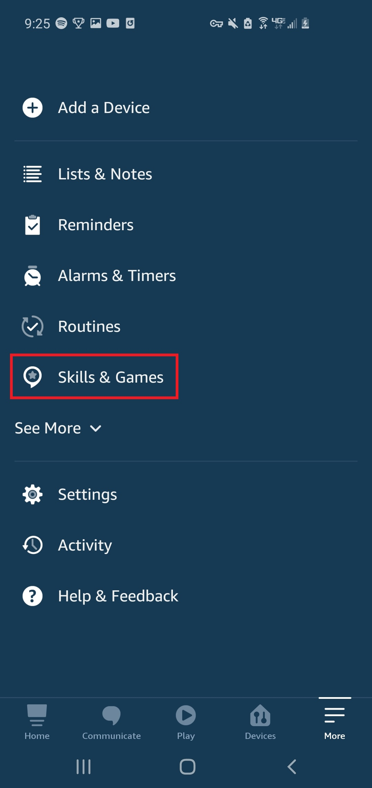

### So you'd like to enable the Signal Mountain Bible Church Alexa Skill... well you've come to the right place!

<!--more-->

#### There are two main methods to enable the skill: 1) Enable in the Skill Market via the Alexa app 2) Enable via the Amazon Website. We will cover both.

#### Caution
The account that the device is registered to must be the account that enables the skill. For example: If Joe bought an Echo Dot and wants to use the SMBC skill and he asked his wife, Sally to enable the skill. If she enables from her account (and they aren't set up as a Family account), Joe won't be able to use the skill on his registered device. The easiest way to solve this problem is to either 1) have one person buy all of the devices and handle all of the skill enabling or 2) set up your accounts as a Family account in Amazon (and even this I think is not foolproof)

### Enable via the Skill Market via the Alexa app

First step is to ensure you have the Alexa app and are signed in.

On Android, the Alexa app can be downloaded here: [Android Alexa App](https://play.google.com/store/apps/details?id=com.amazon.dee.app "Android Alexa App")

On iPhone, the Alexa app can be downloaded here: [iTunes Alexa App](https://apps.apple.com/us/app/amazon-alexa/id944011620 "iTunes Alexa App")

Once the app is installed, log-in using your standard Amazon credentials. Note: The images below are from an Android device and may be different for iPhones.

Once you are logged into the Alexa app it should look something like this:

---

  

---

Once opened, in the very bottom right, click the **"More"** button with the three lines.

Then on the left, click **"Skills and Games"**, as shown below:

---

  

---

Once in the skills, click the **magnifying glass button** (shown below) to search for a skill.

---

  

---

Search for "Signal Mountain Bible Church" as shown below. When results return, look for the skill Named Signal Mountain Bible Church with the SMBC icon. Click on that skill.

---

  

---

Now that you are on the skill, click Enable!

---

  

---

You now should be good to go! Wait a few minutes and ask: "Alexa, open Signal Mountain Bible Church"

### Enable via the Amazon Website

Browse to theAlexa Skill in the Amazon store via this link: [SMBC Alexa Skill](https://www.amazon.com/Jared-Wilson-Dev-Signal-Mountain/dp/B08KHH86X3/ "SMBC Alexa Skill")

Ensure you are logged into the account that the Alexa devices are connected to, if not login now.

---

  

---

Click the **Enable** button to enable the skill... and done! You now should be good to go! Wait a few minutes and ask: "Alexa, open Signal Mountain Bible Church"

### Some Alexa Examples:

- Alexa Open Signal Mountain Bible Church.
- Alexa Ask Signal Mountain Bible Church What is the Scripture reading?
- Alexa Ask Signal Mountain Bible Church What is the memorization verse?
- Alexa Ask Signal Mountain Bible Church What songs are we singing?
- Alexa Ask Signal Mountain Bible Church What are all of the sermons?
- Alexa Ask Signal Mountain Bible Church Play the last recent sermon.
- Alexa Ask Signal Mountain Bible Church Get last week's scripture reading.
- Alexa Ask Signal Mountain Bible Church What is last week's scripture memorization verse.
- Alexa Ask Signal Mountain Bible Church What are last week's songs?
- Alexa Ask Signal Mountain Bible Church Play the sermon {sermon name here}

### Providing Feedback / Reviews:

If you have an issue you can provide feedback to me directly (if you know me) or you can submit feedback via the Skill in the Alexa app. Follow the steps highlighted above to get to the SMBC skill and then scroll to the very bottom to the **"Feedback"** button, and document your issues.

---

  

---

If you would like to provide a review, this can be done via the Amazon webpage (here: [SMBC Alexa Skill](https://www.amazon.com/Jared-Wilson-Dev-Signal-Mountain/dp/B08KHH86X3/ "SMBC Alexa Skill")) or within the Alexa skill shown in the above image.

# Enjoy!!
